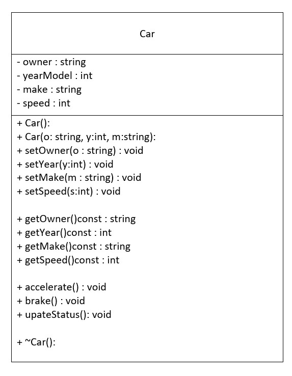
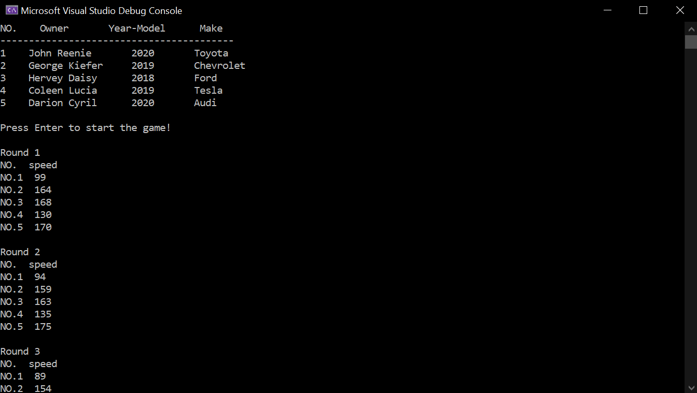
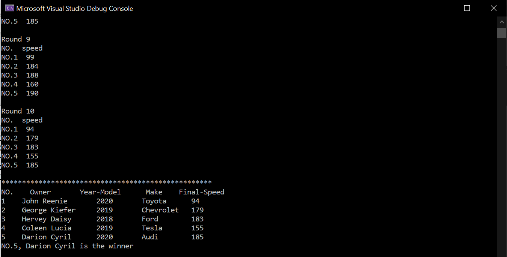

# CarRaceGame
Write a class named Car, performs the following:\

Write a program that reads data from carData.txt and stores 5 car objects in an array. \
The program should display the information of each car on screen before the game start. \
The game starts when the program enters in a loop with 10 iterations. \
Every iteration of the loop calls updateStatus function of each car. \
At the end of iterations, display information of each car and announce the winner having highest speed.\
Store winner car’s information in a file, winner.txt

***************************************************

  ==================================================\
  Here is the sample output

Developer: Fiavi Y.\
2/7/2021
